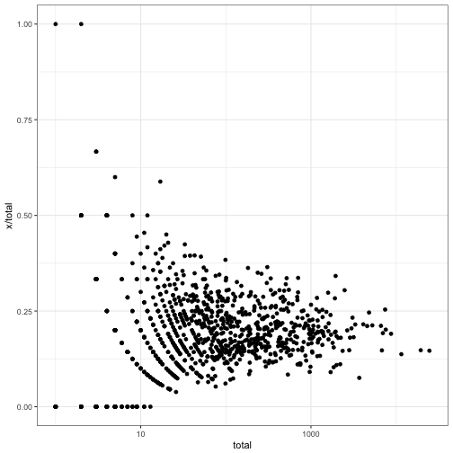
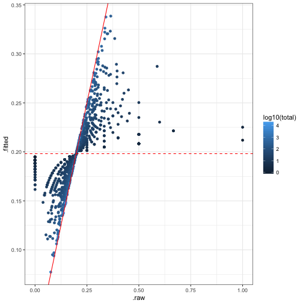
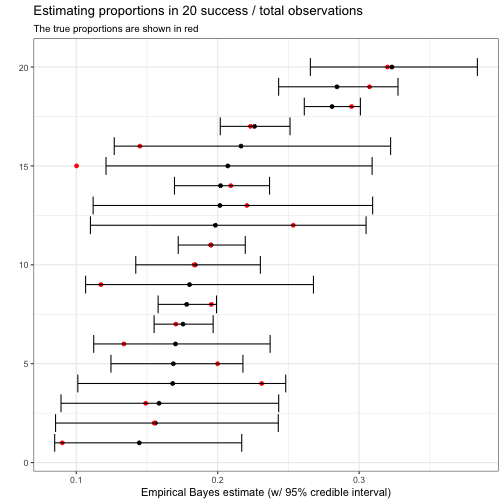

<!-- README.md is generated from README.Rmd. Please edit that file -->


ebbr: Empirical Bayes on the Binomial in R
----------

**License**: MIT

[](https://travis-ci.org/dgrtwo/ebbr)
[](https://ci.appveyor.com/project/dgrtwo/ebbr)
[](https://codecov.io/github/dgrtwo/ebbr?branch=master)

Methods for empirical Bayes shrinkage and estimation on data with many observations of success/total counts. These methods are described in [this series of blog posts on baseball batting averages](varianceexplained.org/r/ebbr-package), but can be applied to a variety of data types.

### Installation

You can install the package from GitHub using [devtools](https://cran.r-project.org/web/packages/devtools/index.html):


```r
devtools::install_github("dgrtwo/ebbr")
```

### Functions

`ebbr` provides two types of functions: ones that fit particular models, and ones that add columns to data:

* `ebb_fit_prior` fits a beta to a dataset of success/total counts using maximum likelihood estimation. It includes `tidy` to retrieve the alpha/beta parameters and `augment` to update observations with the prior.
* `add_ebb_estimate` is a shortcut for performing `ebb_fit_prior` to fit a prior, then updating each observation to create a posterior.
* `add_ebb_prop_test` performs an empirical Bayesian version of a one-sample or two-sample proportion test, comparing each observation in the data to either a fixed threshold or to another beta posterior.
* `ebb_fit_mixture` fits a mixture of beta distributions as the prior.

### Example

Suppose we simulated some data from a beta-binomial model. Each observation has a true probability drawn from a beta distribution (with $$\alpha=10;\beta=40$$, and a mean of 20%). However, the totals vary, such that our estimate of `x / total` has a lot of noise for some observations:


```r
library(dplyr)
library(ggplot2)

set.seed(2017)
obs <- 1000
sim_dat <- data_frame(prob = rbeta(obs, 10, 40),
                  total = round(rlnorm(obs, 4, 2)) + 1,
                  x = rbinom(obs, total, prob))
```


```r
ggplot(sim_dat, aes(total, x / total)) +
  geom_point() +
  scale_x_log10()
```



We would want to shrink towards a beta prior, a process [described here](http://varianceexplained.org/r/empirical_bayes_baseball/). We can fit a beta prior using `ebb_fit_prior`:


```r
prior <- sim_dat %>%
  ebb_fit_prior(x, total)

prior
## Empirical Bayes binomial fit with method mle 
## Parameters:
## # A tibble: 1 × 2
##      alpha    beta
##      <dbl>   <dbl>
## 1 11.39115 46.0875
```

Notice that the function takes the data frame first, since it is designed to be pipeable, and that the following two arguments are the success column and the total column. This computes an estimate of the prior based on maximum likelihood estimation, and gets rather close to the true alpha and beta values.

We could then use that prior to update each individual. The `add_ebb_estimate` is a shortcut for both fitting the prior and updating observations, which is the most common use case:


```r
shrunken <- sim_dat %>%
  add_ebb_estimate(x, total)

shrunken
## # A tibble: 1,000 × 9
##          prob total     x   .alpha1    .beta1   .fitted       .raw
##         <dbl> <dbl> <int>     <dbl>     <dbl>     <dbl>      <dbl>
## 1  0.32006461   182    66  77.39115  162.0875 0.3231651 0.36263736
## 2  0.19505291  1015   198 209.39115  863.0875 0.1952404 0.19507389
## 3  0.25341384     5     1  12.39115   50.0875 0.1983261 0.20000000
## 4  0.10021963    12     3  14.39115   55.0875 0.2071305 0.25000000
## 5  0.19552697  1259   223 234.39115 1082.0875 0.1780440 0.17712470
## 6  0.23109059    40     5  16.39115   81.0875 0.1681512 0.12500000
## 7  0.09012239    49     4  15.39115   91.0875 0.1445468 0.08163265
## 8  0.19990156   188    30  41.39115  204.0875 0.1686140 0.15957447
## 9  0.18335891   238    43  54.39115  241.0875 0.1840781 0.18067227
## 10 0.22318899  1046   238 249.39115  854.0875 0.2260045 0.22753346
## # ... with 990 more rows, and 2 more variables: .low <dbl>, .high <dbl>
```

This adds columns to the data, including the raw `x / total` estimate (`.raw`) and the shrunken empirical Bayes estimate (`.fitted`):


```r
ggplot(shrunken, aes(.raw, .fitted, color = log10(total))) +
  geom_point() +
  geom_abline(color = "red") +
  geom_hline(yintercept = tidy(prior)$mean, color = "red", lty = 2)
```



The output also includes credible intervals for each observation. For example, we could examine the estimates and credible intervals of the first 20, and compare them to the true proportions:


```r
shrunken %>%
  head(20) %>%
  ggplot(aes(.fitted, rank(.fitted))) +
  geom_point() +
  geom_point(aes(x = prob), color = "red") +
  geom_errorbarh(aes(xmin = .low, xmax = .high)) +
  labs(x = "Empirical Bayes estimate (w/ 95% credible interval)",
       y = "",
       title = "Estimating proportions in 20 success / total observations",
       subtitle = "The true proportions are shown in red")
```



As expected, the 95% credible intervals contain the true proportions about 95% of the time.

### Code of Conduct

Please note that this project is released with a [Contributor Code of Conduct](CONDUCT.md). By participating in this project you agree to abide by its terms.
